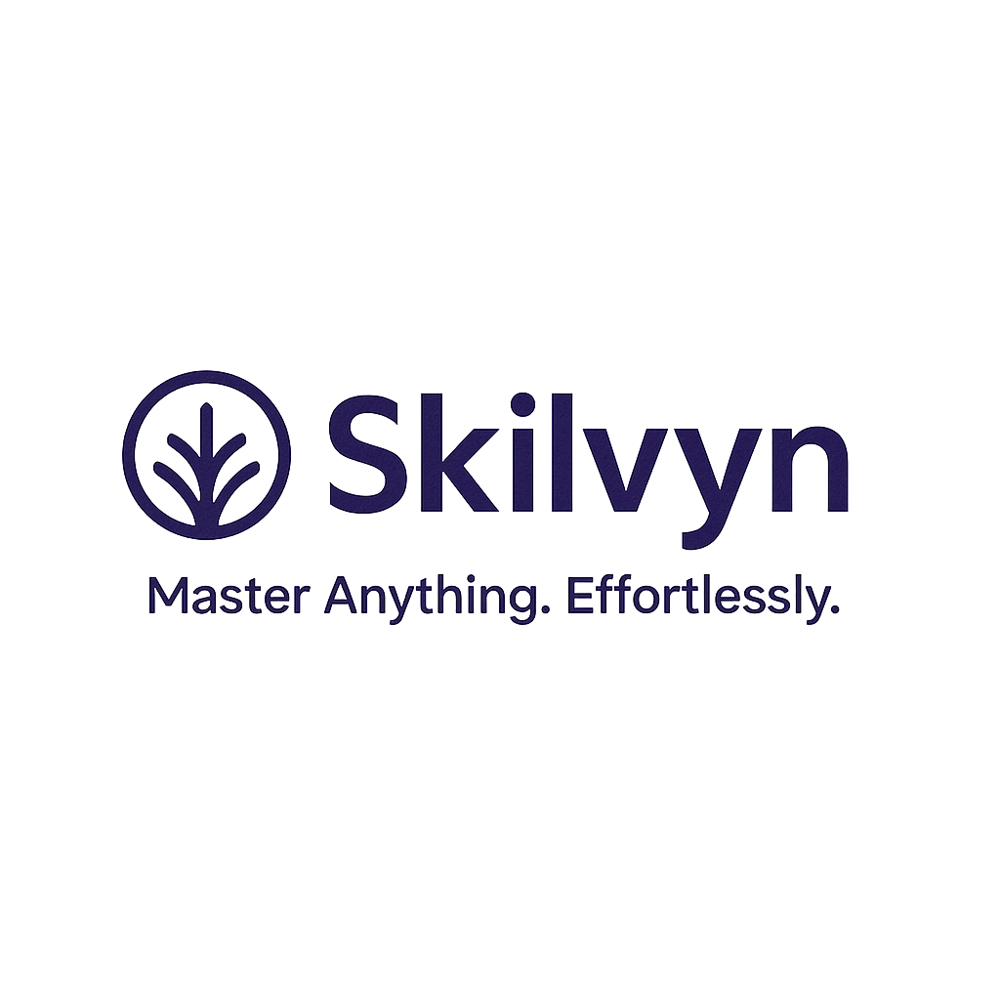

# Skilvyn  
**Master Anything. Effortlessly.**

Skilvyn is an interactive generative‑AI platform that empowers you to learn prompt engineering and diverse future skills through personalized 7-day learning plans, engaging exercises, and real-time AI feedback.

---

## 🚀 Features

- **🎯 Personalized 7‑Day Learning Plans**  
  Generate a unique roadmap based on your name, skill level, goals, and daily availability.

- **🧠 Interactive AI‑Tutor Exercises**  
  Practice prompt-writing, get instant feedback, and see example answers for guidance.

- **📚 Expandable Learning Modules**  
  Start with Prompt Engineering, and in future releases explore new skills like marketing and data analysis.

- **💬 AI‑Powered Chat Tutor**  
  Ask anything related to your learning path or specific exercises.

---

## 📁 Project Structure

skilvyn/ ├── .streamlit/ │   └── config.toml ├── assets/ ├── utils/ ├── main.py ├── requirements.txt └── README.md

---

## 🧩 Tech Stack

- **Streamlit** – for UI components and interactive widgets  
- **OpenAI GPT-3.5‑turbo** – to generate personalized learning plans and tutor feedback  
- **session_state** – to store user info and plan during the session

---

## ⚙️ Getting Started

### 1. Setup
```bash
git clone https://github.com/yn5b/skilvyn.git
cd skilvyn
python -m venv venv
source venv/bin/activate  # or venv\Scripts\activate on Windows
pip install -r requirements.txt

2. Add your API key

In .streamlit/secrets.toml:

OPENAI_API_KEY = "your_openai_api_key_here"

3. Run the app locally

streamlit run main.py

4. Deploy on Streamlit Cloud

Push your code to GitHub.

Create a new app using branch main and file main.py.

It will deploy automatically via share.streamlit.io.
